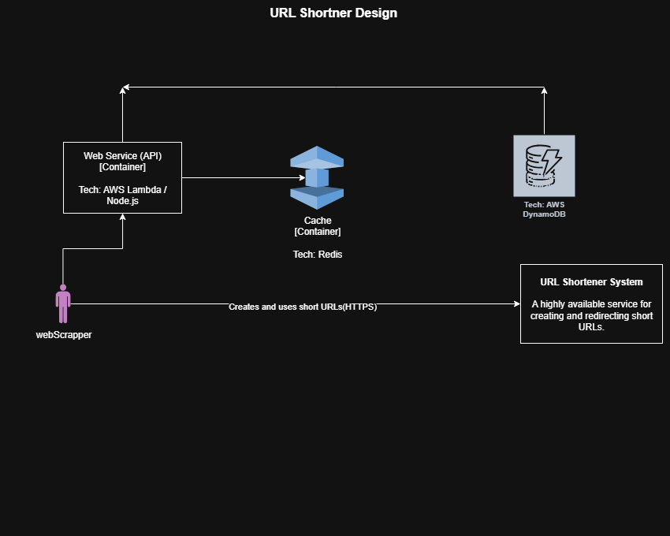

# Project 1: System Design for a Scalable URL Shortener

### **1. Overview**

This document outlines the architecture for a highly scalable URL shortening service, similar to TinyURL or bit.ly. The system is designed to handle millions of URLs and billions of redirects with high availability and low latency. The primary goal is to convert a long URL into a short, unique alphanumeric code that redirects to the original URL.

---

### **2. System Architecture**

The architecture is designed using the C4 model for visualizing software systems. The C1 diagram shows the high-level context, while the C2 diagram shows the internal container structure.

#### **C1: System Context Diagram**

This diagram shows the relationship between the user and the system. The user interacts with the URL Shortener System to create and use short links.




#### **C2: Container Diagram**

This diagram shows the internal components of the system. It consists of a stateless API, a NoSQL database for primary storage, and an in-memory cache for performance.


---

### **3. API Design**

The service exposes a simple REST API for creating and redirecting URLs.

#### **Endpoint 1: Create Short URL**
* **Method:** `POST`
* **Path:** `/api/v1/shorten`
* **Request Body:**
    ```json
    {
      "longUrl": "[https://www.very-long-and-complex-url.com/with/path/and/params](https://www.very-long-and-complex-url.com/with/path/and/params)"
    }
    ```
* **Success Response (201 Created):**
    ```json
    {
      "shortUrl": "[http://short.ly/aB1cD2e](http://short.ly/aB1cD2e)"
    }
    ```

#### **Endpoint 2: Redirect Short URL**
* **Method:** `GET`
* **Path:** `/{short_code}` (e.g., `/aB1cD2e`)
* **Response:** An **HTTP 302 Found** redirect to the original long URL.
* **Error Response (404 Not Found):** If the `short_code` does not exist.

---

### **4. Data Model**

A single table in a NoSQL database (DynamoDB) is used to store the URL mappings.

* **Table Name:** `UrlMappings`
* **Primary Key:** `short_code` (String) - This allows for direct, fast lookups.
* **Attributes:**
    * `short_code` (String): The 7-character unique code.
    * `long_url` (String): The original URL.
    * `created_at` (Timestamp): The creation date.

---

### **5. Core Logic**

#### **URL Shortening Flow (Write Path)**
1.  The client sends a `POST` request with the `longUrl`.
2.  The **Web Service** generates a hash (e.g., MD5) of the `longUrl` and takes the first 7 characters to create a `short_code`.
3.  The service queries the **Database** to check if this `short_code` already exists.
    * If it exists (collision), a salt is added to the `longUrl` and it is re-hashed until a unique code is found.
4.  The new `{short_code, long_url}` pair is saved in the **Database**.
5.  The full `shortUrl` is returned to the client.

#### **URL Redirection Flow (Read Path) - Cache-Aside Pattern**
1.  The client sends a `GET` request to `/{short_code}`.
2.  The **Web Service** first queries the **Cache (Redis)** for the `short_code`.
    * **Cache Hit:** If found, the `long_url` is returned immediately.
    * **Cache Miss:** If not found, the service queries the **Database**.
3.  Upon finding the record in the database, the service updates the **Cache** with the mapping.
4.  The service issues an **HTTP 302 redirect** to the client with the retrieved `long_url`.

---

### **6. Architecture Decisions & Trade-offs**

* **NoSQL Database (DynamoDB) over SQL:**
    * **Reasoning:** The primary access pattern is a simple key-value lookup. NoSQL databases excel at this, providing better performance and scalability for this specific use case than a relational database.
    * **Trade-off:** We lose the ability to perform complex relational queries, which are not needed for this system.

* **Serverless Compute (AWS Lambda) over Traditional Servers:**
    * **Reasoning:** Traffic for a URL shortener can be unpredictable. Serverless automatically scales with demand (from zero to thousands of requests) and is highly cost-effective as we only pay for execution time.
    * **Trade-off:** Potential for "cold starts" on the first request, which is a minor issue for a high-traffic service.

* **Dedicated Caching Layer (Redis):**
    * **Reasoning:** Redirects must be extremely fast. A cache provides in-memory access to popular links, which is orders of magnitude faster than querying a database. This also protects the database from the massive read load.
    * **Trade-off:** Increased system complexity and cost. We also have to manage data consistency between the cache and the database.
